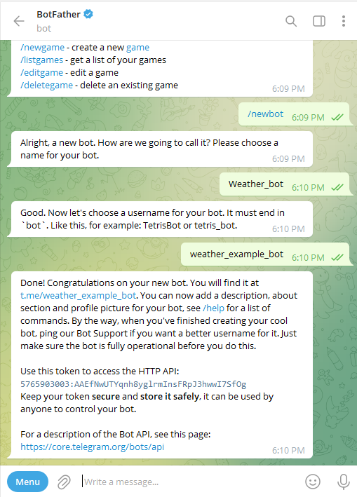

## Telegram bot chat 

Step 1: create bot chat by API of telegram: 
[Botfather](https://t.me/botfather)
    
    - /newbot
    - name of bot (example: Weather_bot)
    - username of bot (example: weather_example_bot)
    

